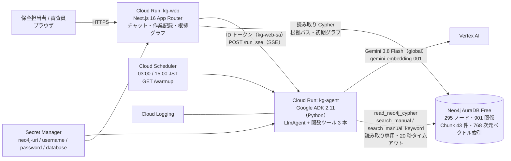
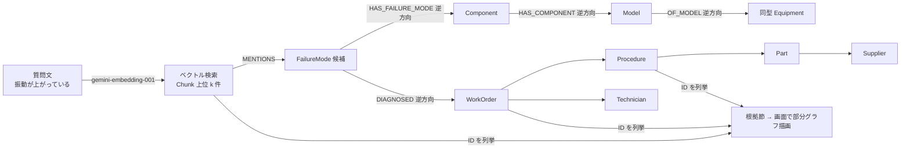

# システムアーキテクチャ（Google Cloud 版）

2026-10-06 更新。AI Builder Cup 2026 提出構成。旧構成（Claude Desktop ＋ MCP）はブランチ `legacy/claude-mcp` と docs/google_tasks.md の棚卸し表を参照。

## 全体図

## コンポーネント

| # | コンポーネント | 実体 | 役割 |
| --- | --- | --- | --- |
| 1 | kg-web | `web/`。Next.js 16（standalone）を Cloud Run で公開。URL https://kg-web-7ikzkb2evq-an.a.run.app | 質問入力、エージェントの SSE を中継して逐次表示、回答中の ID をチップ化、根拠部分グラフを d3-force ＋ SVG で描画、EN/JA 切替 |
| 2 | kg-agent | `agent/`。ADK の FastAPI アプリ（`/run_sse`、セッション API）＋ `/warmup`。認証必須（kg-web-sa のみ起動可） | Gemini がツールを呼んでグラフを辿り、固定フォーマット（結論 / 原因候補 / 推奨対処 / 根拠）で回答 |
| 3 | ツール read_neo4j_cypher | `agent/kg_agent/tools.py` | 読み取り専用 Cypher。CREATE/MERGE/SET/DELETE/DROP/プロシージャ呼び出しは実行前に拒否。最大 50 行、20 秒でタイムアウト |
| 4 | ツール search_manual | 同上 | 質問を `gemini-embedding-001`（RETRIEVAL_QUERY、768 次元）で埋め込み、Neo4j ベクトル索引で手順書チャンクを検索。チャンクが MENTIONS する部位・故障モードを返す |
| 5 | ツール search_manual_keyword | 同上 | 全文索引（cjk アナライザ）で型番検索 |
| 6 | Neo4j AuraDB Free | インスタンス `1b707502`（GCP シンガポール、Neo4j 5.27） | グラフ本体。ベクトル索引・全文索引を内蔵。3 日無操作で停止するため Scheduler でウォームアップ |
| 7 | Vertex AI | Gemini 3.8 Flash（`global` ロケーション。asia-northeast1 では未提供）、gemini-embedding-001 | 推論と埋め込み。認証は Cloud Run のサービスアカウント（ADC） |
| 8 | データパイプライン | `scripts/gen_workorders.py` → `load.py` → `translate_names.py` → `embed.py` → `verify.py` | 合成データ生成、投入、英語名付与、チャンク埋め込み、検証 |
| 9 | 評価 | `agent/rehearse.py`（代表質問を複数回実行して期待値と照合）、`agent/eval/`（ADK evalset ＋ LLM 審査） | 正答率・応答時間・ツール呼び出し回数を記録 |
| 10 | インフラ | `infra/00_setup_project.sh` → `01_secrets.sh` → `10_deploy_agent.sh` → `20_deploy_web.sh` → `30_scheduler.sh` | 再現可能なデプロイ |

## 質問 1 のリクエストの流れ

1. kg-web が `/api/chat` でセッションを作成し、kg-agent の `/run_sse` を ID トークン付きで呼ぶ。SSE をそのままブラウザへ中継する
2. Gemini が `search_manual("冷却ポンプ 振動増大", model_id="CP-200")` を呼ぶ。手順書 CP-200 の「2.1 振動・異音の確認」チャンクと、候補の故障モード（主軸ベアリング内輪摩耗、芯ずれ、不釣合い）が返る
3. Gemini が `read_neo4j_cypher` を 1 回呼び、P-301 の故障モード候補を過去の作業報告件数で並べ、解消する手順と必要資格を取る
4. 回答本文（約 16〜30 秒）。ブラウザは `functionCall` / `functionResponse` イベントを作業記録として、部分テキストを本文として逐次描画する
5. 回答完了後、kg-web が本文から ID（WO / PR / CH / PT / T / FM / 設備 / 型式）を抽出し、`/api/evidence` で引用ノード同士の最短経路（3 ホップ以内。中継は引用ノードか Line / Model / Component / FailureMode）を取得して右ペインに描画する

## 「ベクトルで入口を見つけ、グラフで文脈を辿り、ID で根拠を示す」

## セキュリティ

- kg-agent は未認証アクセス不可。kg-web のサービスアカウント（`roles/run.invoker`）と Cloud Scheduler（OIDC）だけが呼べる
- Neo4j の認証情報は Secret Manager から環境変数として注入。リポジトリには含めない
- ツールは読み取り専用。書き込み句は正規表現で拒否し、トランザクションも READ モードで開く（`agent/tests/test_tools.py`）
- データはすべて合成。実在企業名・人名を含まない

## コスト（審査期間 10/19〜11/6 の見込み）

| 項目 | 見込み |
| --- | --- |
| Gemini 3.8 Flash | 1 質問あたり入力 1〜2 万トークン。審査員の試行 100 問で数 USD |
| 埋め込み | チャンク 43 件 ＋ 質問ごと 1 回。1 USD 未満 |
| Cloud Run × 2 | min-instances 0 なら無料枠内。審査期間は 1 にして 10〜30 USD |
| AuraDB Free | 0 USD |
| Secret Manager / Scheduler / Logging | 1 USD 未満 |

## 次フェーズでの拡張点

| 拡張 | 変更箇所 |
| --- | --- |
| 顧客実データ | data/*.csv を設備台帳・作業報告に置き換え、load.py の列マッピングを調整 |
| マニュアル PDF からの自動抽出 | embed.py の前段に Gemini による構造化抽出（部位・故障モード・手順）を置く |
| センサー時系列 | Equipment に Sensor / Reading ノードを追加し、振動トレンドから故障モードを予測 |
| 作業報告の自動下書き | 人の承認を挟む書き込みツールを別エージェントとして追加 |
| Spanner Graph への移行 | Cypher 互換の GQL へ書き換え。Google ネイティブのグラフ DB で運用する選択肢 |
