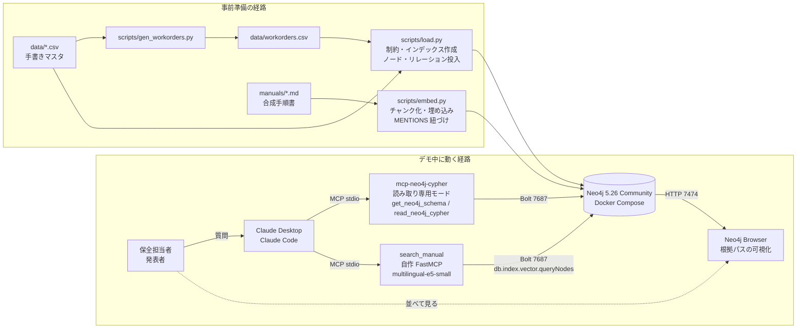
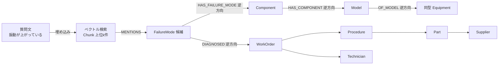

# システムアーキテクチャ

## 全体図



## コンポーネント

| # | コンポーネント | 実体 | 役割 | 自作か |
| --- | --- | --- | --- | --- |
| 1 | Neo4j | neo4j:5.26-community（docker-compose.yml） | グラフ本体。ベクトル索引・全文索引を内蔵 | 既製 |
| 2 | Neo4j Browser | Neo4j 同梱、http://localhost:7474 | 根拠パスの可視化。queries/paths.cypher を貼って表示 | 既製 |
| 3 | mcp-neo4j-cypher | v0.6.0、venv にインストール。mcp/neo4j_cypher/server.py から python 直起動で `--read-only`（Desktop がシェバン起動を権限エラーで落とすため） | Claude からの Cypher 実行とスキーマ取得 | 既製 |
| 4 | search_manual | mcp/search_manual/server.py（FastMCP） | 質問文を e5 で埋め込み、Chunk をベクトル検索し MENTIONS 先の部品・故障モードを返す | 自作 |
| 5 | Claude Desktop / Claude Code | MCP クライアント | エージェント本体。システムプロンプト（docs/prompt.md）で回答手順と根拠形式を固定 | 既製 |
| 6 | データ生成 | scripts/gen_workorders.py | 作業報告80件を分布設計どおりに生成 | 自作 |
| 7 | 投入 | scripts/load.py | 制約・インデックス作成、CSV 投入（Python ドライバ、冪等） | 自作 |
| 8 | 埋め込み | scripts/embed.py | 手順書をチャンク化し e5 で埋め込み、Chunk ノードと MENTIONS を投入 | 自作 |

## データフロー

### 事前準備

1. `docker compose up -d` で Neo4j を起動
2. `python scripts/gen_workorders.py` で data/workorders.csv を生成
3. `python scripts/load.py` でスキーマ作成と全 CSV の投入
4. `python scripts/embed.py` で manuals/*.md をチャンク化し Chunk ノードを投入
5. `python scripts/verify.py` で代表質問4本の Cypher を実行し期待値と照合

### デモ中（質問1の例）

1. 発表者が Claude に「P-301 で振動が上がっている」と入力
2. Claude が search_manual("冷却ポンプ 振動増大") を呼び、該当チャンクと MENTIONS 先の FailureMode 候補を得る
3. Claude が read_neo4j_cypher で P-301 → Model → Component → FailureMode ← Symptom{振動増大} と、過去の WorkOrder・Procedure を取得
4. Claude が固定フォーマットで回答し、根拠節に WO / PR / CH の ID とパスを列挙
5. 発表者が Neo4j Browser で paths.cypher の該当クエリを実行し、同じパスを可視化

## 「ベクトルで起点を見つけ、グラフで文脈を辿る」



ベクトル検索は「どこから入るか」だけを決め、答えの中身はグラフの構造から取る。根拠は常にノードIDとパスで示せる。

## MCP 設定

### Claude Desktop（~/Library/Application Support/Claude/claude_desktop_config.json）

```json
{
  "mcpServers": {
    "neo4j-maintenance": {
      "command": "/Users/kuro/Desktop/dev/m-kg-maintenance/.venv/bin/python",
      "args": ["/Users/kuro/Desktop/dev/m-kg-maintenance/mcp/neo4j_cypher/server.py"],
      "env": {
        "NEO4J_URI": "bolt://localhost:7687",
        "NEO4J_USERNAME": "neo4j",
        "NEO4J_PASSWORD": "maintenance-demo",
        "NEO4J_DATABASE": "neo4j"
      }
    },
    "search-manual": {
      "command": "/Users/kuro/Desktop/dev/m-kg-maintenance/.venv/bin/python",
      "args": ["/Users/kuro/Desktop/dev/m-kg-maintenance/mcp/search_manual/server.py"]
    }
  }
}
```

### Claude Code（リポジトリ直下 .mcp.json）

同じ2サーバーを定義する。パスはリポジトリ相対（.venv/bin/...）で書く。読み取り専用モードでは write_neo4j_cypher ツールが公開されない。

## セキュリティ

- mcp-neo4j-cypher は読み取り専用モードで起動し、write ツールを公開しない
- search_manual は読み取り Cypher のみ実行する
- Neo4j はローカルのみにバインド。パスワードは .env（git 管理外）
- データはすべて合成。実在企業名・人名を含まない

## 次フェーズでの拡張点

| 拡張 | 変更箇所 |
| --- | --- |
| 顧客実データ | data/*.csv を顧客の設備台帳・作業報告に置き換え、load.py の列マッピングを調整 |
| マニュアル PDF からの自動抽出 | embed.py の前段に LLM Knowledge Graph Builder を置く |
| センサー時系列 | Equipment に Sensor/Reading ノードを追加 |
| Web チャット画面と根拠パスのクリック表示 | Claude API ＋ Neo4j 可視化ライブラリ（NVL）で独自UI |
| claude.ai コネクタ | mcp-neo4j-cypher を HTTP トランスポートで公開ホスト |
