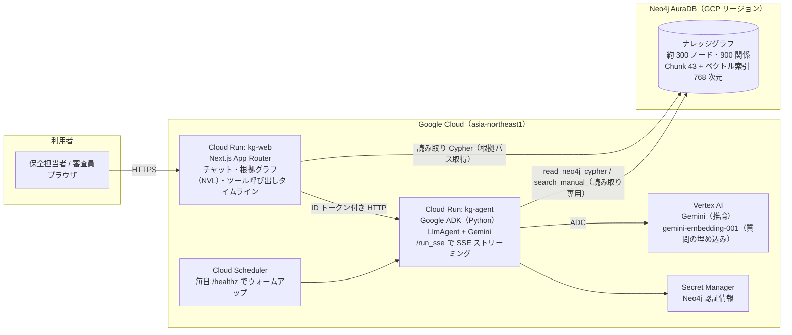

# Google AI Builder Cup 2026 応募：開発計画とタスク

- 作成日：2026-10-06
- 対象：AI Builder Cup 2026（Google Cloud × Hack2skill、JAPAC 最大の Google Cloud ハッカソン）
- テーマ：Manufacturing（「製造・産業オペレーションにおける効率・品質・信頼性・需給・持続可能性の課題を AI で解く」）
- 既存資産：設備保全ナレッジグラフ＋保全エージェント デモ（docs/requirements.md、docs/architecture.md、docs/model.md、docs/tasks.md）
- 凡例：`[ ]` 未着手 `[~]` 作業中 `[x]` 完了 `[!]` ブロック中

---

## 0. まず読む：応募要件と締切（公式サイト 2026-10-06 確認）

| 項目 | 内容 | 出典 |
| --- | --- | --- |
| 登録・チーム結成 | 2026-09-01 〜 **2026-10-11** | aibuildercup.com |
| 構築・提出期間 | 2026-09-07 〜 **2026-10-18（提出締切）** | aibuildercup.com |
| 審査 | 2026-10-19 〜 2026-11-06（この期間中、デプロイ済みアプリが常時動いている必要がある） | aibuildercup.com |
| ファイナリスト発表 | 2026-11-07 | aibuildercup.com |
| 決勝（シンガポール） | 2026-12-04。渡航は 2 名まで、費用はスポンサー負担 | aibuildercup.com |
| チーム | **2〜4 名。ソロ不可**（ソロ登録後にチーム結成は可）。21 歳以上。学生が 1 人でもいると全員失格。JAPAC 在住 | FAQ |
| 新規性 | **「ハッカソン期間中に作った新規プロジェクトのみ」**。プログラム開始前に着手した既存プロジェクトは対象外 | FAQ |
| 必須技術 | Google の AI モデル（**Gemini** または Gemma）、エージェント基盤（**Agent Platform / Antigravity / AI Studio**）、**Cloud Run または Firebase** にデプロイ。主に他クラウドで作ったものは審査対象外 | themes.html / FAQ |
| 提出物 | ① 動作するデプロイ済み URL、② **公開 GitHub リポジトリ**、③ **3 分以内**のデモ動画（YouTube / Vimeo / Google Drive）、④ 解決策を説明するデッキ（PDF / PPT）、⑤ ドキュメント、⑥ 問題ステートメントのカテゴリ指定。**すべて英語** | themes.html / FAQ |
| 審査基準 | **Technical Merit & Gen AI Implementation 40%**、Problem Alignment & Impact 25%、Innovation & Creativity 25%、User Experience & Solution Design 10% | themes.html |
| 賞 | 総額 USD 30,000（1 位 10,000、2 位 7,000、3 位 5,000、Best use of Google Cloud AI tools 2,000、Most Impactful 2,000、Social Choice 2,000、Best UI/UX 2,000） | rewards.html |

出典：https://aibuildercup.com/ （Overview / themes.html / Faqs.html / rewards.html）、登録ポータル https://hack2skill.com/event/aibuildercup2026/

### 要件から決まる方針

1. **LLM は Gemini に全面置換**。現行の Claude Desktop ＋ MCP 構成は提出対象から外す（国内商談用デモとして別ブランチに残す）。公開リポジトリと資料から Claude 依存を消す。
2. **エージェント基盤は Google ADK（Agent Development Kit）**。Agent Platform の SDK であり、Cloud Run に 1 コマンドでデプロイでき、評価フレームワーク（`adk eval`）が Technical Merit の証拠になる。
3. **埋め込みは Google 製に置換**。`gemini-embedding-001`（テキスト専用、task_type で query / document を区別、768 次元に短縮）を既定にし、環境変数で `gemini-embedding-2` に切替可能にする。ローカル e5 は廃止。
4. **デプロイ先は Cloud Run × 2 サービス**（`kg-agent`：ADK、`kg-web`：Next.js）。Firebase App Hosting は代替として残す。
5. **Neo4j は Google Cloud 上の AuraDB**（GCP リージョン）。Free は 3 日無操作で停止するため、審査期間（10/19〜11/6）は Cloud Scheduler で毎日ウォームアップする。予算があれば Professional 1GB（約 USD 0.09/時、審査期間で USD 60 前後）で停止リスクを消す。
6. **資料・UI・README は英語**。データ値（日本語の設備名・作業報告・手順書）は「日本の工場の実文書を英語話者が引ける」という多言語 GraphRAG の売りに変える（UI 言語切替、マスタに `nameEn` を追加、Gemini が回答言語に合わせて翻訳）。
7. **新規性の説明**：公開リポジトリは新規作成し、コミット履歴は本日以降。既存の合成データ・Cypher 設計は 2026-10-04（構築期間内）に作ったものだが、提出物は「Gemini ＋ ADK ＋ Cloud Run ＋ Web UI」で構成が別物であることを README に明記する。

### チーム（2026-10-06 確定）

| 氏名 | 所属・経歴 | 担当 |
| --- | --- | --- |
| 黒澤 翔（Kakeru Kurosawa） | AIdeaLab COO。元 PwC コンサルティング、元 Sony でエッジ AI の新規事業開発 | プロダクト設計、実装（ADK / Next.js / GCP）、デモ動画、ピッチ構成、提出 |
| 福尾 幸太郎（Kotaro Fukuo）https://jp.linkedin.com/in/kotaro-fukuo | ソフトウェアエンジニア。モバイル・バックエンド 8 年超（React Native / TypeScript / Rails / AWS）。Sansan、Input Logic 等。明治大学 機械情報工学 | ソフトウェアエンジニアリング（フロントエンド／モバイル／基盤）、ロードマップの現場向けモバイル UI。**10/11 までに Hack2skill 登録が必要** |
| 藤岡 淳一（Junichi Fujioka）https://www.linkedin.com/in/junichi-fujioka-66028020a/ | 元 Sony グループ約 30 年、現在は製造業 CFO | 製造現場の課題検証（問題ステートメントの妥当性）、インパクトの定量化（停止時間・保全コスト・技能伝承の損失を金額に）、ピッチの「Problem Alignment & Impact」パート、決勝での業界向け説明 |

- 2 名とも 21 歳以上の社会人、日本在住で要件を満たす。決勝の渡航枠（2 名）とも一致する
- 製造業 CFO が共同メンバーであることは、審査基準の Problem Alignment & Impact（25%）と「Most Impactful Solution」賞に直接効く。デッキに「経営指標との接続（停止 1 時間あたりの損失、予備品在庫、ベテラン退職による対応遅延）」を 1 枚入れる
- 藤岡さんには 10/8 までに「自社または経験上の保全課題で、本プロダクトの 4 つの質問が実際に起きる場面」を 3 つ挙げてもらい、ピッチの冒頭エピソードにする

### 今日中に決める・やること（10/6）

- [x] チーム確定（黒澤・藤岡の 2 名）
- [ ] **10/11 までに 2 名とも Hack2skill で登録し、同じチームに所属**（黒澤がチームを作成し、藤岡さんを招待）
- [x] GCP プロジェクト作成：表示名 `202610-google-Ontology-aiagent`、**プロジェクト ID `empirical-vial-510800-i7`**（自動生成。2026-10-06、黒澤）
- [x] `gcloud` CLI をローカルに導入（Homebrew、SDK 587.0.0。PATH は ~/.zshrc に追記済み）
- [x] `gcloud auth login` と ADC（quota project 設定済み）
- [x] `infra/00_setup_project.sh` 実行済み：API 有効化、kg-agent-sa / kg-web-sa、Artifact Registry `kg`（asia-northeast1）。課金有効を確認（project number 12836768193）
- [x] 新規 GitHub リポジトリ（public）を作成し初回コミット（2026-10-06）
- [ ] 下の「決定事項」D1〜D6 を確定

---

## 1. 既存資産の棚卸し（2026-10-06 時点）

| 領域 | 実体 | 状態 | 応募での扱い |
| --- | --- | --- | --- |
| グラフモデル | docs/model.md：12 ノード・17 リレーション、FailureMode がハブ | 完成 | **そのまま使う**。`nameEn` 属性を追加 |
| 合成データ | data/*.csv（3 ライン、12 設備、5 型式、40 部品構成、37 部品、25 故障モード、15 症状、25 手順、6 技術者、4 サプライヤー、作業報告 80 件） | 完成・検証済み | そのまま使う。英語名列を追加 |
| 手順書 | manuals/*.md 5 本（CP-200、BC-50、PM-800、CT-10、AC-75）→ 43 チャンク | 完成 | そのまま使う。英語版は任意（Gemini で翻訳生成） |
| 投入 | scripts/load.py（MERGE ベース、冪等、制約・インデックス） | 完成 | AuraDB 向けに接続 URI を `neo4j+s://` 対応 |
| 埋め込み | scripts/embed.py ＋ scripts/chunking.py（multilingual-e5-small、384 次元、Neo4j ベクトル索引・全文索引 cjk） | 完成 | **埋め込み関数を Gemini Embedding に置換**。チャンク化・MENTIONS 判定はそのまま |
| 検証 | scripts/verify.py（Q1〜Q4 の Cypher を期待値と照合、35〜170ms）、scripts/verify_csv.py | 完成 | そのまま使う。ADK evalset にも流用 |
| エージェント | Claude Desktop ＋ mcp-neo4j-cypher（読み取り専用）＋ 自作 search_manual（FastMCP） | 完成（応答 20〜55 秒） | **ADK LlmAgent ＋ Gemini に置換**。ツールの Cypher と検索ロジックは移植 |
| プロンプト | docs/prompt.md（役割・禁止事項・スキーマ・回答フォーマット・Cypher 例） | 完成 | ADK の instruction に移植。英語化し、回答言語指示を追加 |
| 可視化 | Neo4j Browser ＋ queries/paths.cypher（手動） | 完成 | **Web UI 内で根拠パスを自動描画**（NVL） |
| デモ動画 | movie/（Remotion、10 シーン 107 秒、日本語字幕、Claude 表記） | 完成 | 英語化・Gemini/GCP 構成に差し替え、実画面録画を合成。**3 分以内** |
| 提案資料 | deck/build.js → docs/discussion_deck.pptx（31 枚、日本語、商談用） | 完成 | 審査用ピッチデッキ（英語、10〜12 枚）を別ビルドで作る |
| 質問カタログ | docs/demo_questions.md（A〜E 14 問、期待値検証済み） | 完成 | UI のサンプル質問と evalset の元にする |
| ローカル環境 | docker-compose.yml（neo4j:5.26-community）、.mcp.json | 完成 | ローカル開発用に残す |

---

## 2. 目標アーキテクチャ（GCP）



### コンポーネント

| # | コンポーネント | 実体 | 役割 | 新規/流用 |
| --- | --- | --- | --- | --- |
| 1 | kg-agent | `agent/`（Python 3.12、google-adk、google-genai、neo4j）。Cloud Run | Gemini がツールを呼んでグラフを辿り、固定フォーマットで回答。SSE でツール呼び出しと本文を逐次送る | 新規（ツールのロジックは mcp/ から移植） |
| 2 | ツール：read_neo4j_cypher | ADK FunctionTool。`session.execute_read` で読み取り専用。書き込み句を含む Cypher は拒否 | 構造検索・集計 | 移植 |
| 3 | ツール：search_manual | ADK FunctionTool。質問を `gemini-embedding-001`（task_type=RETRIEVAL_QUERY、768 次元）で埋め込み、`db.index.vector.queryNodes` で検索し MENTIONS 先を返す | 意味検索（入口） | 移植（埋め込みを置換） |
| 4 | ツール：search_manual_keyword | ADK FunctionTool。全文索引（cjk） | 型番検索 | 移植 |
| 5 | kg-web | `web/`（Next.js App Router、TypeScript、Tailwind、shadcn/ui、@neo4j-nvl/react）。Cloud Run（standalone ビルド） | チャット UI、ツール呼び出しタイムライン、根拠パスの自動描画、サンプル質問、EN/JA 切替 | 新規 |
| 6 | 根拠パス API | `web/app/api/evidence/route.ts`。回答中の ID（P-xxx、WO-、PR-、CH-、PT-、T-）を抽出し、Cypher で部分グラフを返す | 回答の検証可能性を UI で示す | 新規（queries/paths.cypher を流用） |
| 7 | Neo4j AuraDB | GCP リージョン。Free（200k ノード上限で十分）または Professional 1GB | グラフ本体、ベクトル索引、全文索引 | 既存データを投入 |
| 8 | データパイプライン | scripts/load.py、scripts/embed.py（Gemini 版）、scripts/translate_names.py（新規） | 投入・埋め込み・英語名付与 | 流用＋一部新規 |
| 9 | 評価 | `agent/eval/*.evalset.json` ＋ `adk eval`（tool_trajectory、final_response_match_v2、hallucinations_v1） | 代表質問 4 本＋幻覚テスト 2 本を自動評価し、README に結果を載せる | 新規 |
| 10 | インフラ | `infra/`（deploy.sh、cloudbuild.yaml、scheduler.sh） | 再現可能なデプロイ | 新規 |

### リクエストの流れ（質問 1 の例）

1. 利用者が kg-web で「P-301 の振動が上がっている。原因と過去の対処は？」を送る
2. kg-web のサーバー側ルートが kg-agent の `/run_sse` を呼び、イベントを SSE でブラウザに中継する
3. Gemini が `search_manual` → `read_neo4j_cypher`（故障モード候補＋過去 WO＋手順）→ `read_neo4j_cypher`（部品・技術者）の順に呼ぶ。各ツール呼び出しがタイムラインに表示される
4. 回答本文が固定フォーマット（結論 / 原因候補 / 推奨対処 / 根拠）でストリーミングされる
5. 回答完了時に kg-web が根拠 ID を抽出し、`/api/evidence` で部分グラフを取得して NVL で描画。ノードをクリックすると属性が見える

### Gemini モデル選定

| 用途 | 既定 | 代替 | 備考 |
| --- | --- | --- | --- |
| エージェント推論 | `gemini-3.8-flash`（2026-10 時点の最新 Flash。**Vertex AI では `global` ロケーションのみ提供**、asia-northeast1 は 404） | `gemini-3.1-pro-preview`（精度優先）、`gemini-3.5-flash`（asia-northeast1 でも可） | 環境変数 `AGENT_MODEL` で切替。`GOOGLE_CLOUD_LOCATION=global`（Cloud Run のリージョンとは別に `infra/env.sh` の `VERTEX_LOCATION`） |
| 埋め込み | `gemini-embedding-001`（2,048 トークン、task_type あり、`output_dimensionality=768`） | `gemini-embedding-2`（8,192 トークン、task_type は指示文で代替） | 次元数を変えたらベクトル索引を作り直す |
| 翻訳（マスタ英語名） | `gemini-3.5-flash-lite` | — | 一度だけ実行して CSV に保存 |

---

## 3. 決定事項（10/6 に確定する）

| # | 論点 | 推奨 | 理由 |
| --- | --- | --- | --- |
| D1 | エージェント基盤 | **ADK（Python）を Cloud Run に**。Vertex AI Agent Engine は任意 | 要件の「Agent Platform」を満たし、`adk deploy cloud_run` と `adk eval` が使える。Agent Engine は追加の学習コストがあり 12 日では見送り |
| D2 | ツール接続方式 | **ADK FunctionTool にネイティブ移植**（MCP は使わない） | Cloud Run 上でサブプロセスを持たず、起動が速い。MCP サーバーのコード（Cypher、検索ロジック）はそのまま関数化できる |
| D3 | 言語 | **UI は EN 既定 / JA 切替。マスタに `nameEn` を追加。作業報告 note と手順書は日本語のまま、Gemini が回答言語で要約・引用** | 全資料英語が必須。データまで英訳すると 12 日に収まらない。「日本語の現場文書を英語で引ける」は JAPAC 審査員に刺さる差別化 |
| D4 | Neo4j の稼働先 | **AuraDB Free（GCP リージョン）＋ Cloud Scheduler で毎日ウォームアップ**。予算が取れれば Professional 1GB | 無料。審査期間 3 週間の停止リスクは Scheduler で回避。Spanner Graph への移行は Cypher 資産を捨てることになるので見送り（「次の拡張」として資料に書く） |
| D5 | フロントのデプロイ先 | **Cloud Run**（Dockerfile、`output: 'standalone'`） | agent と同じ運用。Firebase App Hosting は Next.js 対応が良いので代替に残す |
| D6 | 回答→根拠グラフの連携 | **回答本文から正規表現で ID を抽出し、Cypher で部分グラフを取得** | ADK の `output_schema` はツール併用不可。ID 抽出は決定的でテストしやすい。将来は `cite_evidence` ツールで構造化 |
| D7 | 認証 | kg-web は公開、kg-agent は `--no-allow-unauthenticated` にし kg-web のサービスアカウントが ID トークンで呼ぶ | 審査員がログイン不要で触れる。エージェント API の直叩きを防ぐ。間に合わなければ共有ヘッダ鍵で代替 |
| D8 | セッション | ADK の InMemory セッション（インスタンス 1 台、min-instances=1） | 会話の継続（質問 2「その対処」の指示語）に必要。Firestore 永続化は任意 |

---

## 4. 日程（10/6 〜 10/18、12 日）

| 日 | フェーズ | 完了条件 |
| --- | --- | --- |
| 10/6（月） | P0 準備 | チーム登録、GCP プロジェクト、GitHub 公開リポジトリ、決定事項確定 |
| 10/7〜10/8 | P1 バックエンドを Gemini/ADK 化（ローカル） | `adk web` で Q1〜Q4 に根拠 ID 付きで正答。`adk eval` が通る |
| 10/8〜10/9 | P2 GCP デプロイ（agent ＋ AuraDB） | Cloud Run の `/run_sse` に curl で質問し、AuraDB を参照した回答が返る |
| 10/9〜10/13 | P3 フロントエンド（Next.js） | デプロイ済み URL でチャット・ツールタイムライン・根拠グラフが動く |
| 10/13〜10/15 | P4 品質・評価・ドキュメント | リハーサル 5 回中 4 回以上正答、応答 30 秒以内、README（英語）完成 |
| 10/14〜10/17 | P5 動画・デッキ・提出 | 3 分動画（英語）、ピッチデッキ（英語 PDF）、提出フォーム入力 |
| 10/17〜10/18 | バッファ | 最終確認、審査期間の監視設定 |

分担：黒澤が P0〜P5 の実装・制作全般を担当。藤岡さんは P4（インパクトの定量化、README の課題・効果の章のレビュー）と P5（デッキの問題・インパクト・ロードマップのページ、動画ナレーション原稿の現場表現チェック、提出前の最終レビュー）を担当。10/8・10/13・10/16 に 30 分の同期を入れる。

---

## 5. タスク詳細

### P0：準備（10/6）

- [ ] チーム結成と Hack2skill 登録（全員）。問題ステートメントは Manufacturing を選択
- [x] GCP：プロジェクト ID `empirical-vial-510800-i7`（表示名 202610-google-Ontology-aiagent）、リージョンは `asia-northeast1`。API 有効化・SA・Artifact Registry は `infra/00_setup_project.sh`（認証後に実行）。課金が有効か確認する
- [x] ローカル：`gcloud` インストール済み。google-adk 2.11.0 が Python 3.13 の既存 venv に入ることを確認（3.12 への切替は不要）。Node 24 導入済み
- [ ] ローカル：`gcloud auth application-default login`（Vertex AI をローカルから叩くため）
- [x] GitHub：https://github.com/kurorooooo/kg-maintenance-agent （public、MIT、README 英語）。main は Gemini/ADK 構成、`legacy/claude-mcp` に旧構成
- [x] `mcp/`、`.mcp.json`、docs/prompt.md を `legacy/claude-mcp` に退避し main から削除
- [ ] リポジトリ構成を決める

```
google-kg-maintenance/
├── agent/                 # Cloud Run: kg-agent（ADK）
│   ├── kg_agent/
│   │   ├── __init__.py
│   │   ├── agent.py       # root_agent = LlmAgent(model, instruction, tools)
│   │   ├── tools.py       # read_neo4j_cypher / search_manual / search_manual_keyword
│   │   ├── prompt.py      # instruction（英語。回答言語は会話に合わせる）
│   │   └── neo4j_client.py
│   ├── eval/
│   │   └── demo_questions.evalset.json
│   ├── main.py            # get_fast_api_app（/healthz 追加）
│   ├── Dockerfile
│   └── requirements.txt
├── web/                   # Cloud Run: kg-web（Next.js App Router）
├── scripts/               # load.py / embed.py（Gemini）/ translate_names.py / verify.py
├── data/  manuals/  queries/
├── infra/                 # deploy_agent.sh / deploy_web.sh / scheduler.sh / cloudbuild.yaml
├── docs/                  # google_tasks.md（本書）/ architecture.md（更新）/ submission/
├── deck/                  # pitch_deck（英語）ビルド
└── movie/                 # Remotion（英語版）
```

### P1：バックエンドを Gemini / ADK 化（10/7〜10/8）

データ・埋め込み

- [x] `scripts/common.py` と `.env.example`：`EMBED_MODEL` / `EMBED_DIM` / `GOOGLE_*` を追加。`neo4j+s://` は AuraDB 接続時に確認
- [x] `scripts/embed.py`：埋め込みを `agent/kg_agent/embeddings.py`（Gemini Embedding、RETRIEVAL_DOCUMENT、768 次元、L2 正規化、バッチ失敗時は 1 件ずつ）に置換。索引は DROP → 再作成。`--dry-run` 維持。**実行は ADC 取得後**
- [x] `scripts/translate_names.py`（Gemini、構造化出力、冪等。2026-10-06 実行済み）：lines / models / equipment / components / parts / failure_modes / symptoms / procedures / technicians / suppliers の `name`（と手順の `summary`、故障モードの `description`）を Gemini で英訳し `nameEn` 等の列として CSV に追記。人名はローマ字化。`load.py` で `nameEn` を SET
- [x] `scripts/load.py`：`nameEn` / `summaryEn` / `descriptionEn` の投入。Aura で確認済み
- [ ] ローカル Docker の Neo4j で `load.py --reset` → `embed.py` → `verify.py` が ALL PASS

ADK エージェント

- [x] `agent/kg_agent/tools.py`（2026-10-06 実装、ローカル Neo4j で読み取り確認済み）：
  - `read_neo4j_cypher(query: str, params: dict | None)`：`execute_read` のみ。`CREATE|MERGE|DELETE|SET|REMOVE|DROP|CALL db\.|apoc\.(?!text)` を含む場合は拒否。結果は最大 50 行・JSON 化（Date 型は文字列に）
  - `search_manual(query: str, top_k: int = 5, model_id: str | None)`：質問を `RETRIEVAL_QUERY` で埋め込み、mcp/search_manual/server.py の VECTOR_QUERY をそのまま実行
  - `search_manual_keyword(query, top_k, model_id)`：FULLTEXT_QUERY をそのまま
  - 各ツールの docstring を英語で書く（Gemini のツール選択に効く）
- [x] `agent/kg_agent/prompt.py`：docs/prompt.md を英語化して移植。追加ルール：「回答は利用者の言語で書く。日本語の固有名は `nameEn`（英語名）＋ 原語を併記」「根拠節の ID 形式は固定（WO-、PR-、CH-、パス表記）」「ツール呼び出しは 3 回以内」
- [x] `agent/kg_agent/agent.py`：`LlmAgent(name="kg_maintenance_agent", model=os.environ["AGENT_MODEL"], instruction=..., tools=[...])`。`generate_content_config` で temperature 0.2
- [x] `agent/main.py`：`get_fast_api_app(agents_dir, web=False)` ＋ `/healthz`（`RETURN 1` を実行して AuraDB をウォームアップ）。`agent/Dockerfile`、`agent/requirements.txt` も作成
- [x] `agent/tests/test_tools.py`：読み取り専用ガード（SET/CREATE/CALL dbms 等を拒否、`n.set` のような属性名は許可）、日付の JSON 化、ツール配線。17 件 PASS
- [x] `agent/ask.py`（CLI。ツール呼び出しと所要時間を表示、`--session` で多段会話、`--json` でログ保存）で AuraDB に対して E2E 確認（2026-10-06、gemini-3.8-flash @ global）。Q1〜Q4、E1、E2、英語版 Q1 の 7 問すべて期待値と一致。所要 21〜44 秒、ツール呼び出し 1〜3 回。英語質問は英語名＋日本語原語の併記で回答
- [x] 応答の長さを調整：指示文に「聞かれた項目だけ」「date() 確認クエリ禁止」を追加。Q1 は 2 回・16〜23 秒に
- [x] 指示文の見出しを回答言語に統一（結論 / 原因候補 / 推奨対処 / 根拠、過去事例 n 件）
- [ ] Gemini が書いた重い Cypher が 30 秒かかる例があった（A5）。`CYPHER_TIMEOUT_S=20` を導入済み。指示文に「OPTIONAL MATCH の連鎖で直積を作らない。collect で先に集約する」を追加
- [ ] `agent/eval/demo_questions.evalset.json`：Q1〜Q4、E1、E2 を登録（期待ツール軌跡、参照回答）。`adk eval agent/kg_agent agent/eval/demo_questions.evalset.json` を通す。評価設定は `tool_trajectory_avg_score` を緩め（順序不問）、`final_response_match_v2` と `hallucinations_v1` を使う
- [ ] 応答時間の目標：Q1 で 15 秒以内（Flash）。超える場合はプロンプト短縮、`top_k` 削減、Cypher の 1 回化

### P2：GCP デプロイ（agent ＋ AuraDB）（10/8〜10/9）

- [x] AuraDB Free 作成（インスタンス `1b707502`、名前 `202610-google-ontology-aiagent`、Neo4j 5.27-aura、GCP シンガポール）。接続情報は `.env.aura`（gitignore）と Secret Manager（`neo4j-uri` / `neo4j-username` / `neo4j-password` / `neo4j-database`）に登録。DB 名は `neo4j` ではなく `1b707502`
- [x] macOS の python.org 版 Python は OS 証明書を使わないため、`certifi` を `SSL_CERT_FILE` に設定（scripts/common.py、agent/kg_agent/neo4j_client.py）
- [ ] 未使用の 2 つ目のインスタンス `80d9c6e3`（My instance）はコンソールから削除
- [x] ローカルから AuraDB に `load.py --reset` → `embed.py` → `verify.py` ALL PASS（252 ノード・715 関係・43 チャンク 768 次元。Q1〜Q4 PASS、最長 921ms）
- [x] `agent/Dockerfile`（python:3.12-slim）、`agent/.gcloudignore`（.env・tests を除外）
- [x] `infra/10_deploy_agent.sh`（2026-10-06 デプロイ済み、URL https://kg-agent-7ikzkb2evq-an.a.run.app 、認証必須、min-instances は当面 0。審査前に 1 へ）：`gcloud run deploy kg-agent --source agent --region asia-northeast1 --no-allow-unauthenticated --min-instances 1 --set-env-vars GOOGLE_GENAI_USE_VERTEXAI=TRUE,GOOGLE_CLOUD_PROJECT=...,GOOGLE_CLOUD_LOCATION=...,AGENT_MODEL=...,EMBED_MODEL=...,EMBED_DIM=768 --set-secrets NEO4J_URI=neo4j-uri:latest,NEO4J_PASSWORD=neo4j-password:latest`
- [x] サービスアカウント：kg-agent-sa に `roles/aiplatform.user`、`roles/secretmanager.secretAccessor`
- [x] `/run_sse` に ID トークン付きで E1 を投げ、29 秒で正答を確認（セッション作成 → run_sse）。`/healthz` と `/health` は Cloud Run / ADK に取られるため、Neo4j 疎通チェックは `/warmup` に配置
- [x] Cloud Scheduler `kg-agent-warmup`：03:00 / 15:00 JST に `/warmup` を OIDC（kg-web-sa）で呼ぶ。`infra/30_scheduler.sh`
- [ ] Cloud Logging でツール呼び出しと Cypher を確認できるようにする（構造化ログ）

### P3：フロントエンド Next.js App Router（10/9〜10/13）

セットアップ

- [x] Next.js 16.3（App Router、TypeScript、Tailwind v4）、`output: 'standalone'`。shadcn/ui は使わず Tailwind のみで実装（依存を減らすため）。書体 IBM Plex Sans / Sans JP / Mono
- [x] 環境変数：`AGENT_URL`、`NEO4J_*`（Secret Manager）、`NEXT_PUBLIC_DEFAULT_LOCALE=en`。ローカルは `web/.env.local`（gitignore）

画面（1 ページ構成、3 カラム）

- [x] 左：サンプル質問 13 問（A1〜A5、B1〜B3、C1〜C2、D1〜D2、E1〜E2、EN/JA）とセッションリセット
- [x] 中央：チャット。SSE で逐次表示。回答中の ID（WO / PR / CH / PT / T / FM / 設備 / 型式）をチップ化し、クリックで右のグラフ上で強調（パルス）
- [x] 各回答の上部に「エージェントがしたこと」：ツール名、検索語、件数、所要時間、Cypher の折りたたみ。最後のツール完了後は「回答を作成中」を表示
- [x] 右：根拠グラフ。NVL ではなく d3-force ＋ SVG を自作（ラベル別配色、矢印、関係名、ホバーで近傍強調、クリックで属性パネル、ホイールで拡大・ドラッグで移動）。初期表示は P-301 周辺（33 ノード）
- [x] ヘッダ：EN / JA 切替（localStorage に保存。回答言語は質問の言語で決まる）、「仕組み」ポップオーバー、GitHub リンク

API（サーバー側ルート）

- [x] `app/api/chat/route.ts`：kg-agent の `/run_sse` を ID トークン付きで呼び SSE を中継。セッションは初回に作成（既存なら無視）。ID トークンは Cloud Run では SA、ローカルでは `gcloud auth print-identity-token` にフォールバック
- [x] `app/api/evidence/route.ts`：回答本文から ID を抽出し、引用ノード同士の最短経路（3 ホップ以内、中継は引用ノードか Line/Model/Component/FailureMode に限定）で部分グラフを返す。Q1 で 21〜28 ノード、E1 で 7 ノード
- [x] `app/api/graph/overview/route.ts`：P-301 周辺の部分グラフ

デプロイ

- [x] `web/Dockerfile`（node:24-alpine、multi-stage、standalone）、`web/.gcloudignore`
- [x] `infra/20_deploy_web.sh`：デプロイ済み **https://kg-web-7ikzkb2evq-an.a.run.app** （公開、kg-web-sa に kg-agent の run.invoker）。本番で EN/JA の質問→回答→根拠グラフを確認（2026-10-06）
- [ ] カスタムドメインは任意。Cloud Run の `*.run.app` URL で提出可。審査前に両サービスを `MIN_INSTANCES=1` で再デプロイ

UX の仕上げ（審査 10%＋Best UI/UX 賞）

- [ ] 初回訪問時に 20 秒のガイド（3 ステップ：質問を選ぶ → ツールの動きを見る → 根拠グラフを確かめる）
- [x] 応答待ちの間にツールタイムラインと経過秒数が動く
- [x] モバイル幅では「回答 / 根拠」のタブ切替、質問例は折りたたみ

### P4：品質・評価・ドキュメント（10/13〜10/15）

- [x] リハーサル：`agent/rehearse.py` で 9 ケース × 5 回＝45 ターン、全て正答（docs/eval/rehearsal.md、README に掲載）。中央値 19〜35 秒、ツール 2〜3 回
- [x] `adk eval`：7 ケース全て PASS。回答一致 1.00、幻覚チェック 1.00（会話ケースのみ 0.86）。docs/eval/adk_eval.md、README に掲載
- [x] 幻覚対策の確認：E1 / E2 で「記録なし」（各 5/5）。書き込み Cypher の拒否は `agent/tests/test_tools.py`
- [ ] 負荷・コスト：Cloud Run の同時実行とタイムアウト（300 秒）、Gemini の 1 日あたり利用量を見積もる（審査員 10 名 × 10 問でも数 USD）
- [x] README.md（英語）：問題、解決策、構成図、GCP サービス一覧、手順、評価結果、データ説明、チーム、ライセンス
- [x] docs/architecture.md を GCP 構成に全面改訂。docs/submission/links.md に提出物一覧と審査期間の運用チェック
- [ ] 日本語の既存 docs は残して良いが、README から「Claude」「MCP」の記述を消す。docs/prompt.md は `legacy` へ

### P5：デモ動画・ピッチデッキ・提出（10/14〜10/17）

デモ動画（3 分以内、英語）

- [ ] 構成案（2 分 50 秒）
  1. 0:00〜0:20 課題：保全の判断材料が 4 か所に散在、夜勤でベテラン不在（movie/ の Problem シーンを英語化）
  2. 0:20〜0:45 解決策：ナレッジグラフ ＋ Gemini エージェント、「ベクトルで入口、グラフで文脈、ID で根拠」（Architecture シーンを GCP 構成に差し替え）
  3. 0:45〜2:15 実画面：Q1（症状 → 故障モード → 手順書ページ）、Q2（型式経由で別ラインへ横断）、Q3（部品在庫・技術者）、E1（記録なし）。ツールタイムラインと根拠グラフが動く様子を見せる
  4. 2:15〜2:40 技術：ADK ＋ Gemini ＋ Vertex AI Embeddings ＋ Cloud Run ＋ AuraDB、`adk eval` の結果、読み取り専用設計
  5. 2:40〜2:55 インパクトと次の一手：4 週間で顧客データに展開、センサー時系列、作業報告の自動下書き
- [x] 実画面を Playwright で録画（movie/record.mjs、本番 URL、1440×810 → 1920×1080）。Remotion `DemoEn` で OffthreadVideo 合成。ナレーションは Gemini TTS（gemini-3.8-flash-tts、Kore、scripts/gen_narration.py）。**2026-10-06 レンダリング完了：2 分 31 秒、movie/out/demo_en.mp4**
- [ ] YouTube に限定公開でアップロードし URL を提出（黒澤。ファイルは movie/out/demo_en.mp4）

ピッチデッキ（英語、PDF、10〜12 枚）

- [x] `deck/build_pitch.js`（6 色テーマ流用、英語、コンサル形式のアクションタイトル）。13 枚。2026-10-07 生成、docs/pitch_deck.pdf
  1. タイトル / チーム
  2. 問題（製造現場の保全ノウハウの散在、ベテラン退職）
  3. なぜ今の RAG では解けないか（横断質問）
  4. 解決策（KG ＋ Gemini エージェント、3 つの仕組み）
  5. デモ（スクリーンショット 2 枚：回答と根拠グラフ）
  6. アーキテクチャ（Google Cloud サービス）
  7. Gen AI 実装の要点（ADK、関数ツール、埋め込み、幻覚防止、評価）
  8. 評価結果（正答率、応答時間、`adk eval`）
  9. インパクト（停止時間削減、技能伝承、導入 4 週間）。藤岡さん執筆：製造業 CFO の視点で停止 1 時間の損失・予備品在庫・ベテラン退職コストを金額換算
  10. 新規性（グラフを根拠にする設計、多言語現場文書、読み取り専用安全設計）
  11. ロードマップ（センサー時系列、書き込みエージェント、Spanner Graph 検討）
  12. チーム / リンク（デプロイ URL、GitHub、動画）
- [x] PDF 書き出し（soffice --headless）

提出

- [ ] 提出フォーム：デプロイ URL、GitHub URL、動画 URL、デッキ PDF、ドキュメント（README）、カテゴリ Manufacturing
- [ ] 提出前チェック：シークレットがリポジトリにない、README の手順で第三者が再現できる、デプロイ URL がシークレットウィンドウで開ける、動画が 3:00 未満
- [ ] 審査期間（10/19〜11/6）の監視：Cloud Scheduler のウォームアップが動いている、Uptime check でダウン通知、Gemini のクォータ

---

## 6. 審査基準への対応表

| 基準 | 配点 | 本プロダクトでの見せ方 |
| --- | --- | --- |
| Technical Merit & Gen AI Implementation | 40% | ADK エージェント ＋ 3 つの関数ツール、Gemini Embedding ＋ Neo4j ベクトル索引の GraphRAG、固定フォーマットと ID 根拠による幻覚抑制、読み取り専用ツール設計、`adk eval` と手動リハーサルの定量結果、Cloud Run 2 サービスの再現可能なデプロイ |
| Problem Alignment & Impact | 25% | 製造現場の実課題（ノウハウ散在・技能伝承・夜勤対応）。Q1〜Q4 で「診断 → 横断 → 次の行動 → 傾向」を一気通貫。顧客データで 4 週間展開の手順 |
| Innovation & Creativity | 25% | 文書 RAG では答えられない横断質問をグラフで解く。根拠パスを回答と並べて自動描画。日本語の現場文書を英語で引ける多言語 GraphRAG |
| User Experience & Solution Design | 10% | ツール呼び出しの可視化、根拠チップ → グラフ強調、サンプル質問、EN/JA、モバイル対応 |
| Best use of Google Cloud AI tools（特別賞） | — | Gemini、Vertex AI Embeddings、ADK、`adk eval`、Cloud Run、Secret Manager、Cloud Scheduler、Cloud Logging |

---

## 7. リスクと対策

| リスク | 影響 | 対策 |
| --- | --- | --- |
| 登録が 10/11 に間に合わない、または 2 名が別チームになる | 応募不可 | 黒澤がチームを作成し招待リンクを送る。10/9 までに両名の登録完了をスクリーンショットで確認 |
| 「既存プロジェクト」と見なされる | 失格 | 公開リポジトリは新規、提出物は Gemini/ADK/Cloud Run/Web UI の新構成。README に構築期間（9/7〜10/18）内の作業であることを明記 |
| AuraDB Free が審査期間中に停止 | デモ不能 | Cloud Scheduler で 1 日 2 回ウォームアップ。Uptime check。可能なら Professional 1GB |
| Gemini のツール呼び出しが期待と違う（回数超過、Cypher 失敗） | 回答品質 | プロンプトに検証済み Cypher 例を同梱（docs/prompt.md 流用）。`adk eval` で回帰検知。失敗時は Cypher エラーをツール結果で返し自己修正させる（最大 2 回） |
| 応答が 30 秒を超える | UX 低下 | Flash モデル、ツール 3 回以内、`min-instances=1`、ストリーミングで体感短縮 |
| 英語化が間に合わない | 提出不備 | 優先順位：README → デッキ → 動画字幕 → UI 文言 → マスタ英語名。データ本文の英訳はやらない |
| NVL の Next.js（SSR）相性 | 画面が出ない | `dynamic(() => import(...), { ssr: false })`。代替は react-force-graph |
| モデル ID の変更・提供終了 | デプロイ失敗 | `AGENT_MODEL` / `EMBED_MODEL` を環境変数化。デプロイ日に AI Studio で確認 |
| Secret の漏洩 | 失格級 | `.env` は gitignore、Cloud Run は Secret Manager 参照、提出前に `git log -p | grep` で確認 |

---

## 8. コスト見積（審査終了 11/6 まで）

| 項目 | 見積 | 備考 |
| --- | --- | --- |
| Gemini Flash（推論） | 数 USD | 1 質問あたり入力 1〜2 万トークン × 審査員の試行 |
| Gemini Embedding | 1 USD 未満 | チャンク 43 件 ＋ 質問ごとの埋め込み |
| Cloud Run × 2（min-instances=1） | 10〜30 USD | 常時 1 インスタンス。無料枠で相殺される部分あり |
| AuraDB | Free は 0 USD / Professional 1GB は約 65 USD/月 | Free ＋ ウォームアップが既定 |
| Cloud Scheduler / Secret Manager / Logging | 1 USD 未満 | |

---

## 9. 参考リンク

- 公式：https://aibuildercup.com/ （themes.html、Faqs.html、rewards.html）
- 登録：https://hack2skill.com/event/aibuildercup2026/
- ADK：https://adk.dev/ （Cloud Run デプロイ：https://adk.dev/deploy/cloud-run/ 、評価：https://adk.dev/evaluate/ 、MCP ツール：https://adk.dev/tools-custom/mcp-tools/）
- Cloud Run × ADK：https://docs.cloud.google.com/run/docs/ai/build-and-deploy-ai-agents/adk
- Gemini モデル一覧：https://ai.google.dev/gemini-api/docs/models
- Gemini Embeddings：https://ai.google.dev/gemini-api/docs/embeddings
- Vertex AI Text Embeddings：https://docs.cloud.google.com/vertex-ai/generative-ai/docs/embeddings/get-text-embeddings
- Neo4j AuraDB Free：https://neo4j.com/cloud/aura/free/ 、NVL：https://neo4j.com/docs/nvl/current/
